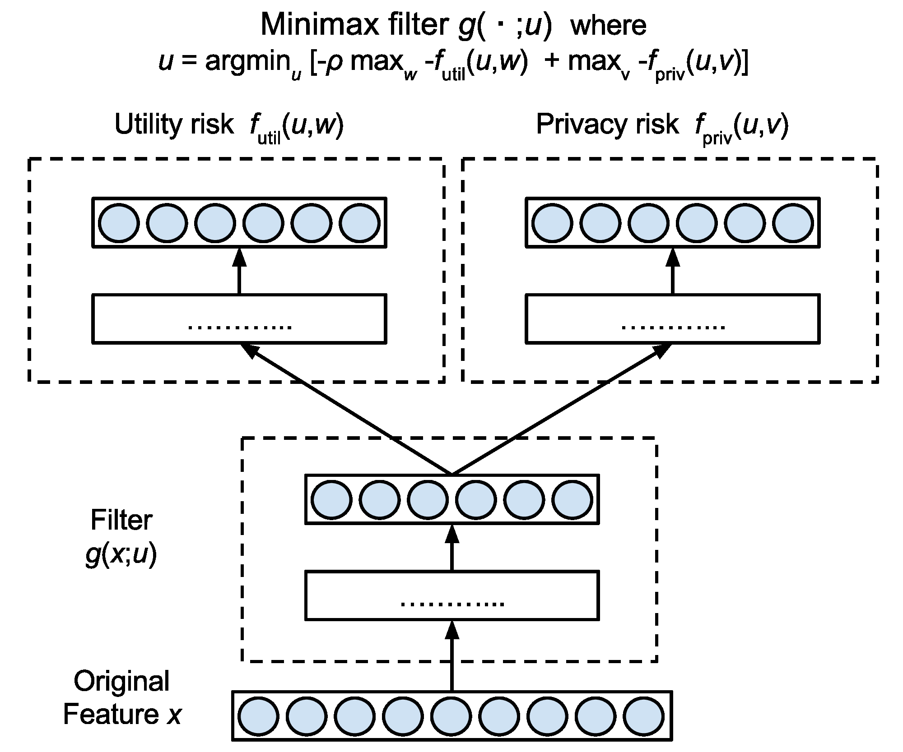

### Minimax Filter
#### is a machine learning approach to preserve privacy against inference attacks
---
Moitvation

The library allows devices (Android, iOS, and python clients) to learn a common classifier/regression model with differential privacy, by solving the distributed ERM problem: min_w f(w) = 1/M sum_{i=1}^M f_i(w), where f_i(w) = 1/n sum_j l(h_w(x_{ij}), y_{ij}).
The library implements private distributed synchronous risk minimization based on [**Hamm'15**], using [Google Firebase](https://firebase.google.com/) as a simple and robust syncrhonization method.  This idea was featured in [Gigaom] (https://gigaom.com/2015/01/22/researchers-show-a-machine-learning-network-for-connected-devices/).

Choosing the type and amount of noise to guarantee differential privacy is left to the library user; the type and the amount 
depend on model assumptions. Please see [Chaudhuri'11], [Rajkumar'12], [Song'13], [Bassily'14], [Hamm'16].
If noise is not used, this library can also serve as a crowd-based, parallel/distributed optimization framework [Tsitsiklis'84], [Agarwal'11], [Dekel'11]. 

### Features
---
#### Implemented client types
Android (JAVA), iOS (Objective C), linux (python)

#### Implemented server types
Node.js

#### Available options

* Loss function / classifiers: binary logistic regression, softmax, binary SVM with hindge loss 
* Noise:  type {Laplace, Gaussian}, scale s
* Learning rate: constant, 1/t, 1/sqrt{t}, AdaGrad, RMSprop
* Client- and server-side minibatch

#### Applications
---
Currently, the system is demonstrated with the MNIST dataset (http://yann.lecun.com/exdb/mnist/),
for 10-class and binary (0-vs-1) classification problems. 
Ideally, the most relevant types of data whose privacy is important are those generated
from smartphones and IoT devices. More examples will be added in the near future. 

### Getting Started
---
#### 1. Set up firebase account.
See [firebase/readme.md](firebase/readme.md) for more instructions.
#### 2. Download and build client apps
Currently, the client uses pre-stored local data such as MNIST.
The users of this library should replace it with custom data sensing or collecting routines.
For iOS devices, see [client/iOS/readme.md](client/iOS/readme.md).
For Android devices, see [client/android/readme.md](client/android/readme.md).
For python clients, see [client/python/readme.md](client/python/readme.md).
#### 3. Download and change server-side app.
See [server/readme.md](server/readme.md) for more instructions.
#### 4. Distribute client apps to users and start the server-side app.

### References
---
* [Hamm'15]: J. Hamm, A. Champion, G. Chen, M. Belkin, and D.Xuan, 
"Crowd-ML: A privacy-preserving learning framework for a crowd of smart devices." In Proceedings of the 35th IEEE
International Conference on Distributed Computing Systems (ICDCS). IEEE, 2015. [pdf](docs/icdcs15_jh_final.pdf)

### License
---
Released under the Apache License 2.0.  See the [LICENSE.txt](LICENSE.txt) file for further details.

